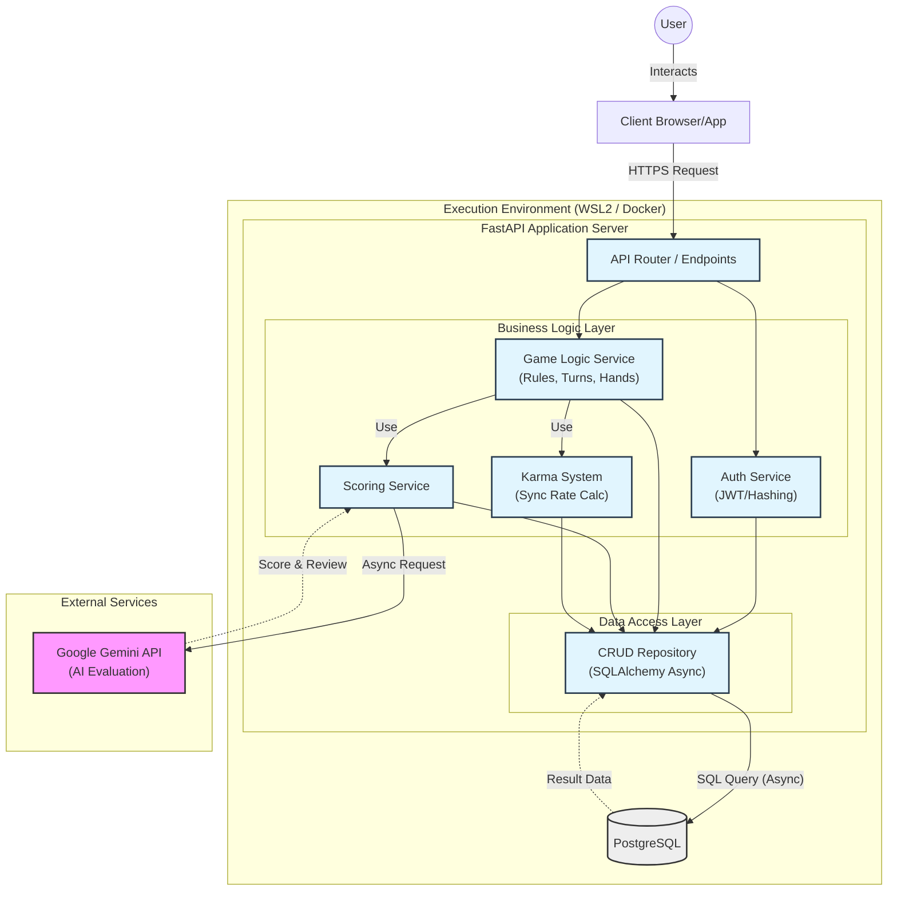
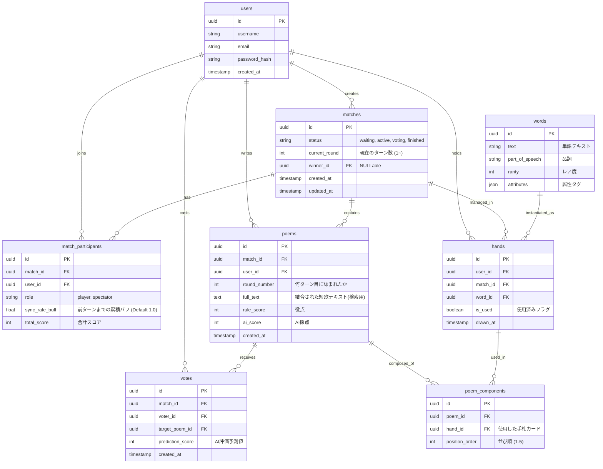

# TankaApp


## 概要
**伝統的な「短歌」 × 生成AIによる「審美眼」 × 戦略的カードゲーム**

本プロジェクトは、短歌（5-7-5-7-7）の形式美と現代的な風刺を組み合わせた対戦型デスクトップアプリケーションです。
生成AI（LLM）を「絶対的な正解者」ではなく「共感すべき第三者」としてゲームロジックに組み込む **「カルマシステム」** を搭載し、人間の評価バイアスを抑制する独自のアルゴリズムを実装しています。

## 開発背景
本プロジェクトは、「既存のSNSには無い短歌対戦アプリを作りたい」という **独自性を追求** し、開発に着手しました。

それと同時に、複雑な独自仕様を長期的に運用・拡張し続けるために、**「堅牢なシステムアーキテクチャの構築」** を主眼とした技術的な実証実験（PoC）としての目的も兼ねています。

過去に設計知識不足によりモノリス化したコードが破綻した経験を反省し、本プロジェクトでは以下のエンジニアリング課題の解決に焦点を当てています。

1.  **Architecture:** 将来的なWeb API化を見据えた、Frontend (KivyMD) と Backend (FastAPI + SQLAlchemy) の完全分離（C/S構成）。
2.  **Maintainability:** `models`, `schemas`, `crud` への責務分離による、変更に強いコードベースの維持。
3.  **Governance:** AIを活用した、ユーザー間評価のモラルハザード（不正な低評価）を防ぐゲームエコノミーの設計。

## 要件定義

### 機能要件
エンジニアリング観点での実装スコープ定義です。

- **ドメインロジック層**
    - **日本語形態素解析：** 読み仮名変換およびモーラ（拍）計算ロジックの実装。
    - **ステート管理：** ターン制進行を厳密に管理するStateMachineの実装。
- **データ永続化層**
    - **マスタ管理：** 語彙、読み、タグ、レアリティを管理する正規化されたスキーマ設計 (3NF)。
    - **トランザクション管理：** 試合結果（Users, Matches, Scores）の整合性担保。
- **プレゼンテーション層**
    - **ホットシート対応：** 1台の端末での交互操作に対応したViewの切り替え制御。

### 非機能要件
実務品質を意識し、以下の特性を担保します。

- **保守性：**
    - 将来的なWebアプリ化（APIサーバー分離）を見据え、ビジネスロジックとUIを疎結合にする**MVCアーキテクチャ**を採用。
- **可用性：**
    - AI APIのレートリミット超過やタイムアウト時、システム全体を停止させず、デフォルトスコアで代替するフォールバック処理 (Circuit Breaker) の実装。
- **性能効率性：**
    - 重い処理（API通信、DB集計）によるUIフリーズを防ぐため、Pythonの`asyncio`を用いた非同期処理の実装。

## 技術スタック
本プロジェクトでは、**「型安全性」** と **「非同期処理」** を重視した選定を行っています。

### Backend & API


-D71F00?style=for-the-badge&logo=sqlalchemy&logoColor=white)


- **Language:** Python 3.12
- **Framework:** FastAPI (Asynchronous Web Framework)
- **ORM:** SQLAlchemy 2.0 (Async Session / Mapped Types)
- **Validation:** Pydantic v2
- **Migration:** Alembic

### Frontend (Client App)


- **GUI Framework:** Kivy (Cross-platform NUI)
- **UI Component:** KivyMD (Material Design)
- **Architecture:** MVC Pattern

### Database


- **RDBMS:** PostgreSQL 16
- **Driver:** asyncpg (High-performance async driver)

### Infrastructure & DevOps


- **OS:** Windows 11 (WSL2 / Ubuntu 22.04 LTS)
- **Container:** Docker / Docker Compose
- **Design:** Mermaid.js (Design as Code)

# アーキテクチャとデータベース設計
### システム構成
本プロジェクトでは、設計の可視化とバージョン管理を両立するため、**「Design as Code」** の手法を採用しました。

従来のGUIツールによる作図ではなく、Markdownベースの Mermaid記法 を用いることで、設計図の変更履歴（Diff）をGit上でコードと同様に追跡可能にしています。

以下は、Mermaidで定義した本システムの論理構成図です。物理的なサーバー配置ではなく、アプリケーション内部の **「責務の分離（Separation of Concerns）」** とデータフローを可視化しています。

FastAPIの実装において、保守性とパフォーマンスを最大化するために以下の設計方針を適用しました。

**1. 3層アーキテクチャの徹底**

処理を Presentation (Router) / Business Logic (Service) / Data Access (CRUD) の3層に明確に分離しました。これにより、将来的にAIモデルやDBが変更された場合でも、他層への影響を最小限に抑える「疎結合」な設計を実現しています。

**2. AI連携における完全非同期I/O**

「AI審査員（Gemini API）」との通信にはレイテンシが伴います。Pythonの async/await を活用してI/O待機時間をノンブロッキング化することで、AIの回答待ち中もサーバーリソースを解放し、他のユーザーのリクエストを並列処理できる高スループットな構成としました。

### ディレクトリ構成
```bash
Otona-Tanka/
├── .vscode/                  # 開発環境設定
├── docs/                     # 設計ドキュメント (要件定義, ER図, シーケンス図)
├── frontend/                 # クライアントサイド (Presentation Layer / KivyMD)
│                             # ※ APIクライアントとしてBackendと疎結合に通信
│
└── backend/                  # サーバーサイド (Application Layer / FastAPI)
    ├── .venv/                # Python仮想環境
    ├── .env                  # 環境変数 (DB接続情報やAPIキー等の機密管理)
    ├── .gitignore            # バージョン管理除外設定
    ├── Dockerfile            # コンテナ定義 (開発/本番環境の差異排除)
    ├── requirements.txt      # 依存ライブラリ一覧
    │
    └── app/                 
        ├── __init__.py    
        ├── main.py           # エントリーポイント (FastAPIアプリの起動とLifespan管理)
        │
        ├── core/             # インフラストラクチャ設定 (Config & Database)
        │   ├── __init__.py   
        │   ├── config.py     # 環境設定クラス (Pydantic BaseSettingsによる型安全な管理)
        │   └── database.py   # 非同期DBセッション管理 (SQLAlchemy Async Engine)
        │
        ├── models/           # データ永続化層 (ORM Model Definitions)
        │   ├── __init__.py   
        │   ├── base.py       # SQLAlchemy Baseクラス
        │   ├── user.py       # ユーザー情報・レート管理テーブル
        │   ├── match.py      # 対戦履歴・スコア管理テーブル
        │   ├── card.py       # 語彙マスタ（上の句・下の句・レアリティ）
        │   └── game.py       # ゲームステート（ターン進行状態）の一時保存
        │
        ├── schemas/          # データ転送層 (Pydantic Schemas / DTO)
        │   ├── __init__.py  
        │   └── ...           # APIリクエスト/レスポンスの型定義とバリデーション
        │
        ├── crud/             # データアクセス層 (Repository Pattern)
        │   ├── __init__.py   
        │   └── ...           # DBへのCRUD操作をカプセル化したロジック
        │
        ├── services/         # ドメインサービス層 (Business Logic)
        │   ├── __init__.py   
        │   ├── ai_judge.py   # 生成AI APIとの連携およびプロンプト制御
        │   └── karma.py      # 【Core】カルマシステム（AI共感度算出アルゴリズム）の実装
        │
        └── routers/          # インターフェース層 (API Endpoints)
            ├── __init__.py   
            └── ...           # URLルーティングとHTTPリクエストのハンドリング
```

### データベース設計 (ER図)
初期の概念設計（Draw.io）から、Mermaid記法による実装レベルの設計へ落とし込む過程で、**「競技の公平性」と「データの整合性」** をシステム的に担保するため、を担保するために以下の2つの構造変更を行いました。その内容とともに、最終的なER図を記載します。


### 1. 状態管理テーブル (hands) の新設による不正防止
初期案ではマスタデータである words のみが存在していましたが、これでは「ユーザーが今どのカードを所有しているか」という状態（State）を管理できず、APIを直接操作された場合に「持っていない単語を使用する」というチート行為を許す脆弱性がありました。

この課題に対し、matches と words の中間テーブルとして hands（手札） を新設しました。 これにより、投稿処理時に「そのカードは当該ユーザーに配られたものか？」「既に使用済み（is_used）ではないか？」という厳密なバリデーションが可能となり、ゲームの公平性をDBスキーマレベルで担保しています。

### 2. 意図的な非正規化による制約の強制 (votes)
投票データの設計において、理論的な正規化よりも実務的な整合性を優先した意図的な非正規化を行いました。

**理論（第3正規形）の視点：**
本来、match_id は target_poem_id を経由して特定可能（推移的関数従属）であるため、votes テーブルに match_id を持たせることは冗長です。

**実践（アプリケーション要件）の視点：**
しかし、本アプリには **「1試合につき、1ユーザーは1回しか投票できない」** というルールが存在します。 これをアプリケーションロジックに依存せず、RDBMSの機能として保証するため、あえて votes テーブルに match_id を持たせ、複合ユニーク制約 (match_id, voter_id) を設定しました。

これにより、万が一アプリケーションコードにバグがあっても、物理的に不正投票（二重投票）が発生しない堅牢な設計としています。
